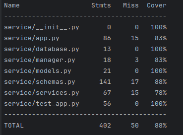

# Сервис для хранения данных о пользователях

### Описание

Написать сервис для хранения данных о пользователях.

При разработке необходимо использовать язык Python. Для работы с БД можно использовать любые библиотеки, реализацию веб-сервера желательно основывать на Aiohttp/FastAPI/Blacksheep.
### Техническое задание

<aside>
Реализуйте функционал:

1. Аутентификация в API каждый запрос происходит с помощью cookie.
2. Администраторы могут видеть все данные пользователей и изменять их.
3. Простые пользователи могут видеть лишь ограниченное число данных обо всех
пользователях и редактировать часть своих данных.
</aside>

[API](https://file.notion.so/f/f/0771f0bb-b4cb-4a14-bc05-94cbd33fc70d/a24643b8-7bff-4195-b5fb-461da2271b4f/kefir_python_junior_test.json?id=cad56bab-4497-485e-b1ed-9c2834ef9ed9&table=block&spaceId=0771f0bb-b4cb-4a14-bc05-94cbd33fc70d&expirationTimestamp=1702290674374&signature=BlcVBj_grI50aoNshwPgTWo7pC_IiX1QRQp-Euj58TA&downloadName=kefir_python_junior_test.json)

Необходимо написать сервер, который реализует этот API.
Так как любой продукт можно сделать лучше, то строгое соответствие API не обязательно.

**Обработка ошибок:**

- Приложение должно отлавливать все внутренние серверные ошибки и отвечать клиенту
в формате JSON с текстом "что-то пошло не так, мы уже исправляем эту ошибку";
- Все ошибки валидации, авторизации, недостатка прав и т.д. в коде выбрасываются
исключениями, исключения обрабатывают общим перехватчиком ошибок.

Тесты, Swagger, контейнеризация - по желанию.
### Требуемый стэк

- python 3.11
- mySQL/PostgreSQL
- Docker

### Инструкции для запуска
варианты запуска:
1. Запуск приложения через файл main.py
2. Сделать билд `docker build . -t "user_service"` ,  запуск приложения через `docker-compose up`
3. Запустить команду "alembic upgrade head" для применения миграций 
(Alembic revision --autogenerate -m "create tables" для создания миграций).Запуск через команду uvicorn service.app:app --reload

При запуске через main.py или Docker создается пользователь администратор которого можно использовать для логина 
#### _email: "admin@mail.ru"_
#### _password: "12345"_ 

### Документация 
### http://127.0.0.1:8000/docs
### Отход от схемы заданного API.

1. Использование OAuth2Security (видно в openapi).
2. Добавлениe эндпоинтов для создания и удаления городов.

[Мой API](https://github.com/Twicheg/Users_data_service/blob/main/my_openapi.json)

### Веб-приложение находиться в папке _User_data_service/service_ , разбор по файлам:
* database.py - конфигурация SQLAlchemy для подключения к базе данных.
* manager.py - переопределение метода перегрузки операций call, класса OAuth2PasswordBearer модуля fastapi.security.
для поиска ключа в Cookie, и проверки аутентификации. 
* models.py - создание моделей пользователей и городов.
* schemas.py - схемы и валидация.
* services.py - вспомогательные функции для обработки информации перед выводом.
* app.py - представления(view+urls) , эндпоинты.
* test_app.py - модуль для тестирования.
* User_data_serice/create_admin - вспомогательный модуль для создание администратора.

### Эндпоинты
* POST 127.0.0.1:8000/login - логин по {"email": "string","password": "string"} и получение куки-файлов
* GET 127.0.0.1:8000/logout - логаут и удаление куки-файлов\
#### для всех аутентифицированных пользователей:
* GET 127.0.0.1:8000/users/current/ - получение информации о текущем пользователе
* PATCH 127.0.0.1:8000/users/current/ изменение информации о текущем пользователе
* GET 127.0.0.1:8000/users/?page=X&size=X - постраничное получение ограниченной информации о всех пользователях
#### для администраторов:
* GET 127.0.0.1:8000/private/users/?page=X&size=X - постраничное получение расширенной информации о всех пользователях
* POST 127.0.0.1:8000/private/users/ - cоздание пользователя
* GET 127.0.0.1:8000/private/users/id - детальное получение информации о пользователе
* DELETE 127.0.0.1:8000/private/users/id - удаление пользователя(если пользователь удалит себя - удаление куки-файлов)
* PATCH 127.0.0.1:8000/private/users/id - изменение информации о пользователе
* POST 127.0.0.1:8000/city/ - создание города
* DELETE 127.0.0.1:8000/city/id - удаление города

### Тестирование

Тестирование производилось с помощью библеотеки _Pytest_:\
`pytest,
pytest --cov`
для тестирования в эндпоинте по созданию пользователя была оставлена лазейка в виде параметра _cheat_for_test_
"потому что только администратор может создавать пользователей, а как залогиниться под пользователем, не создав его?"\
"что бы не делать больших дыр , опустил тесты с правами доступа"
покрытие составило 88% (83% "честных")

### .env Файл:
* DB_USER  - пользователь СУБД , по умолчанию postgres
* POSTGRES_PASSWORD - пароль , задаваемый пользователю и шаблону postgres для docker
* POSTGRES_DB - имя бд , для локального использования и страндартная БД для шаблона docker
* DB_SERVER - 127.0.0.1:5432 локальный и postgres:5432 для докера
* JWT_SECRET_KEY - ключ шифрования для Json Web Toker , который упадет в cookie после логина
* JWT_ALGORITHM - алгоритм шифрования (HS256)
* JWT_ACCESS_TOKEN_EXPIRE_MINUTES - время жизни токена

